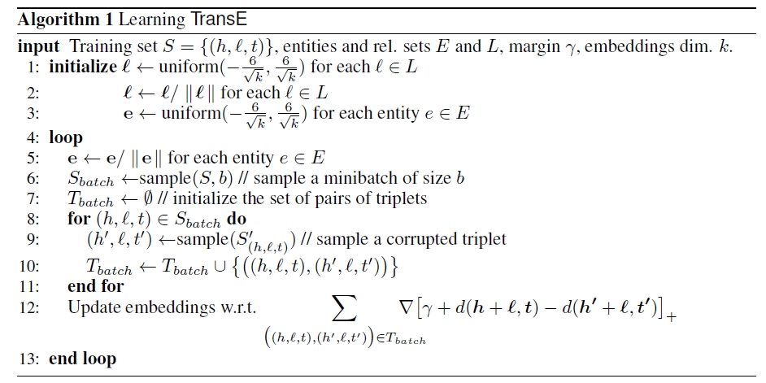
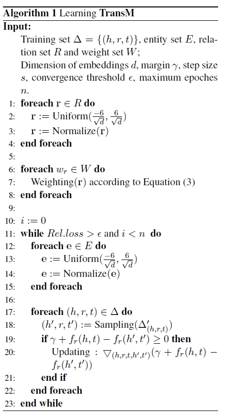
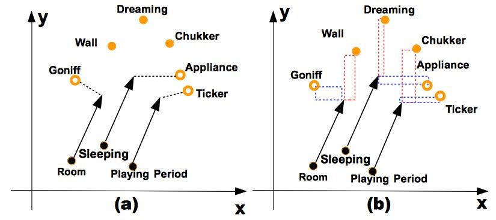

# Trans

[TOC]

## Reference

+ [【读论文】Trans系列知识表示学习方法梳理](<https://zhuanlan.zhihu.com/p/32993044>)
+ [基于翻译模型（Trans系列）的知识表示学习](<https://blog.csdn.net/wp_csdn/article/details/79607727>)
+ [高斯混合模型（GMM）](<https://zhuanlan.zhihu.com/p/30483076>)
+ [中国餐馆过程(Chinese restaurant process)](<https://blog.csdn.net/qy20115549/article/details/52371443>)

## Background

知识图谱通常使用三元组`(h,r,t)`来表示一条知识，在进行实体或者关系的表示的时候，使用`one-hot`向量表示的维度太高，无法表示实体或关系之间的相互联系。类比词向量的表示方法，可以获取实体和关系的分布式表示(distributed representation)，在低维空间中获取实体和关系的稠密表示。

## TransE(2013)

1. 论文：[Translating Embeddings for Modeling Multi-relational Data](<https://papers.nips.cc/paper/5071-translating-embeddings-for-modeling-multi-relational-data>)

2. 要点：在TransE中，关系被表示为在embedding space中的转化(translations)。

   > 如果有$(h,l,t)$存在，那么在embedding space中，实体$t$应该与实体$h$加上某个由$l$决定的向量之和。
   > $$
   > \vec{t}\approx{\vec{h}+\vec{l}}
   > $$

3. 算法说明

   在计算$\vec{h}+\vec{l}$与$\vec{t}$之间的距离$d(\vec{h}+\vec{l},\vec{t})$，可以使用$L_1$或者$L_2$距离。
   
   在学习embedding的时候，最小化**margin-based ranking criterion**：
   $$
   \mathcal{L}=\sum_{(h,l,t)\in{S}}\sum_{(h',l,t')\in{S'_{h,l,t}}}[\gamma+d(\vec{h}+\vec{l},\vec{t})-d(\vec{h'}+\vec{l},\vec{t'})]_{+}
   $$
   其中
   $$
   S'_{h,l,t}=\{(h',l,t)|h'\in{E}\}\cup{\{(h,l,t')|t'\in{E}\}}
   $$
   
   + 负例直接从三元组中将$h$或$t$进行随机替换（但不同时替换）。
   + 对于给定的entity，它出现在三元组的头部和三元组的尾部时embedding是相同的。
   
   + 每个实体的embedding的$L_2$范数保持等于1.
   
4. 算法流程

   

5. 模型缺点

   只适合处理一对一的关系，不适合一对多/多对一的关系。

## TransH(2014)

1. 论文：[Knowledge Graph Embedding by Translating on Hyperplanes](<https://pdfs.semanticscholar.org/2a3f/862199883ceff5e3c74126f0c80770653e05.pdf>)

2. 算法要点：在TransH中，每一个关系$r$都与一个超平面$\mathbb{w_r}$相联系。在每次进行度量头实体$h$和尾实体$t$时，首先将两个实体在$\mathbb{w_r}$的方向上进行投影，然后在投影的超平面上求距离。

3. 算法说明

   头实体向量$\vec{h}$和尾实体向量$\vec{t}$的投影为$\vec{h_{\bot}}$和$\vec{t_{\bot}}$，由此，定义一个score function为$||\vec{h_{\bot}}+\vec{d_{r}}-\vec{t_{\bot}}||$，其中，保持约束$||\mathbb{w_r}||=1$。

   投影向量根据如下式子得到：
   $$
   \mathbb{h_{\bot}}=\mathbb{h}-\mathbb{w_r}^{T}\mathbb{h}\mathbb{w_r}
   $$

   $$
   \mathbb{t_{\bot}}=\mathbb{t}-\mathbb{w_r}^T\mathbb{t}\mathbb{w_r}
   $$

   对应的score function为
   $$
   f_r(\mathbb{h},\mathbb{t})=||(\mathbb{h}-\mathbb{w_r}^{T}\mathbb{h}\mathbb{w_r})+\mathbb{d_r}-(\mathbb{t}-\mathbb{w_r}^T\mathbb{t}\mathbb{w_r})||
   $$
   score function希望对于正确的三元组头实体的映射向量与尾实体的映射向量能够非常接近。

4. 算法训练

   算法训练使用**margin-based ranking loss**：
   $$
   \mathcal{L}=\sum_{(h,l,t)\in{\Delta}}\sum_{(h',l',t')\in{\Delta'_{(h,l,t)}}}[\gamma+f_r(\mathbb{h},\mathbb{t})-f_{r'}(\mathbb{h'},\mathbb{t'})]_{+}
   $$
   其中$[x]_{+}=max(0,x)$，$\Delta$是正例三元组集合，$\Delta'$是负例三元组集合。

   在优化的时候需要满足如下要求：
   $$
   \forall{e\in{E}},||e||_2\le{1}
   $$

   $$
   \forall{r}\in{R},||\mathbb{w}_r^T\mathbb{d}_r||/||\mathbb{d}_r||_2\le\epsilon
   $$

   $$
   \forall{r}\in{R},||\mathbb{w}_r||_2=1
   $$

   第一项保证每个embedding都是归一化的。

   第二项保证$\mathbb{w}_r$和$\mathbb{d}_r$是正交的。

   第三项保证投影向量是单位向量。

   由此，可以将以上的约束优化问题转化为非约束优化问题：
   $$
   \mathcal{L}=\sum_{(h,l,t)\in{\Delta}}\sum_{(h',l',t')\in{\Delta'_{(h,l,t)}}}[\gamma+f_r(\mathbb{h},\mathbb{t})-f_{r'}(\mathbb{h'},\mathbb{t'})]_{+}+C\{\sum_{e\in{E}}[||\mathbb{e}||_2^2-1]_{+}+\sum_{r\in{R}}[\frac{(\mathbb{w}_r^T\mathbb{d}_r)^2}{||\mathbb{d}_r||_2^2}-\epsilon^2]_{+}\}
   $$
   其中，$C$是软约束的超参数。

   对于第三项约束，我们采用每个mini-batch的之前将$\mathbb{w}_r$归一化到单位向量来保证第三项约束成立。

5. 负例生成

   在生成负例的时候，对于**one-many**，**many-one**，**many-many**采取不同的概率去替换头实体和尾实体。

   首先，在所有的三元组中，我们统计每个头实体对应的尾实体数$tph$和每个尾实体对应的头实体数$hpt$。然后定义一个贝努利分布：
   $$
   P=\frac{tph}{tph+hpt}
   $$
   用于采样，以概率$P$对头进行替换，以概率$1-P$对尾实体进行替换。

## TransM(2014)

1. 论文：[Transition-based Knowledge Graph Embedding with Relational Mapping Properties](https://pdfs.semanticscholar.org/0ddd/f37145689e5f2899f8081d9971882e6ff1e9.pdf)

2. 算法要点

   之前的模型没有考虑到解决多样的映射属性，这里的映射属性是指：**ONE-TO-ONE**，**ONE-TO-MANY**，**MANY-TO-ONE**，**MANY-TO-MANY**。
   
   我们由此根据每个训练元组对应的关系映射属性，预先计算**distinct weight**，然后使用这个权重来对score function进行加权。
   
3. 算法说明

   **从直觉上来看**，如果所有正确的三元组的关系都是严格的**ONE-TO-ONE**关系，那么，$\mathbf{h}+\mathbf{r}$就会直接等于$\mathbf{t}$而不会出现冲突。但是，在实际中，只有大约26.2%的**ONE-TO-ONE**的三元组，这些可以通过TransE方法。但是剩余的73.8%就会产生冲突的问题。

   解决该方法一种简单方法就是给每个三元组都赋予一个权重，这个权重表示映射的程度，由于这个权重和映射有关，所以是**relation-specific**的。

   一个简单的度量这个映射程度属性的方式就是数出尾实体的平均连接头实体数$h_rpt_r$以及头实体的平均连接尾实体数$t_rph_r$。计算方式如下
   $$
   h_rpt_r=\frac{\#(\Delta_r)}{\#(distinct(t_r))}
   $$

   $$
   t_rph_r=\frac{\#(\Delta_r)}{\#(distinct(h_r))}
   $$

   其中，$t_r$和$h_r$表示与关系$r$相连的尾实体和头实体个数。得到以上两个值之后就可以计算权重
   $$
   w_r=\frac{1}{log(h_rpt_r+t_rph_r)}
   $$
   和TransE相比，这两种方法的参数量大致相当，而且，我们可以预先计算每个关系$r$的权重$w_r$。

4. 算法训练

   训练的Loss函数为
   $$
   \mathcal{L}=min\sum_{(h,l,t)\in{\Delta}}\sum_{(h',l,t')\in{\Delta'_{(h,l,t)}}}[\gamma+f_r(\mathbb{h},\mathbb{t})-f_{r}(\mathbb{h'},\mathbb{t'})]_{+} \\
   s.t.\forall{e}\in{E},||e||_2=1
   $$
   

## TransR(2015)

1. 论文：[Learning Entity and Relation Embeddings forKnowledge Graph Completion](http://citeseerx.ist.psu.edu/viewdoc/download?doi=10.1.1.698.8922&rep=rep1&type=pdf)

2. 算法要点

   在前面的TransE和TransH中，都假设的是关系向量和实体向量在同一个向量空间中，TransR将每个关系都对应一个不同的关系空间和一个关系向量，在对实体进行计算时，先将实体向量投影到关系空间，然后进行比较。

3. 算法说明

   在TransR里面，将实体和关系使用不同的语义空间表示，两者之间，使用relation-specific矩阵相关联。

   在TransR里面，实体向量在$\mathbb{R}^k$向量空间中，即$\mathbb{h},\mathbb{t}\in{\mathbb{R}^k}$，关系向量在$\mathbb{R}^d$中，即$\mathbb{r}\in\mathbb{R}^d$。两个空间的维度不一定相同。

   对于每一个关系$r$，我们定义一个映射矩阵$\mathbf{M}_r\in{\mathbb{R}^{k\times{d}}}$，这个矩阵用于将实体空间映射到关系空间。我们定义实体在关系空间中的投影向量为
   $$
   \mathbf{h}_r=\mathbf{h}\mathbf{M}_r,\mathbf{t}_r=\mathbf{t}\mathbf{M}_r
   $$
   由此，score function定义为
   $$
   f_r(h,t)=||\mathbf{h}_r+\mathbf{r}-\mathbf{t}_r||_2^2
   $$
   在实际使用中，我们强制保证如下的约束条件：
   $$
   \forall{h,r,t},||\mathbf{h}||_2\le{1},||\mathbf{r}||_2\le{1},||\mathbf{t}||_2\le{1},||\mathbf{hM_r}||_2\le{1},||\mathbf{tM_r}||_2\le{1}
   $$

4. 算法引申CTransR

   Cluster-based TransR的思想来源于对于同一种关系，可能会存在多种更加细致的关系。但前面的方法中，每一个关系都只有一个关系向量。

   首先，对于特定的一个关系$r$，对应的训练集里所有的实体对$(h,t)$被聚类到多个groups里面，每一个group里面的需要有相似的关系向量。对于聚类，每一个实体对$(h,t)$根据向量$(\mathbf{h}-\mathbf{t})$来进行聚类，其中$\mathbf{h}$和$\mathbf{t}$由TransE方法得到。然后，我们对于每一个group单独学习一个关系向量$\mathbf{r}_c$和投影矩阵$\mathbf{M}_r$，我们定义投影向量为：
   $$
   \mathbf{h}_{r,c}=\mathbf{h}\mathbf{M}_r,\mathbf{t}_{r,c}=\mathbf{t}\mathbf{M}_r
   $$
   score function定义为
   $$
   f_r(h,t)=||\mathbf{h}_{r,c}+\mathbf{r}_c-\mathbf{t}_{r,c}||_2^2+\alpha||\mathbf{r}_c-\mathbf{r}||_2^2
   $$
   后面一项是要保证每个group的向量与原始的关系向量不能隔太远 。

5. 算法训练

   定义如下Loss函数用于训练
   $$
   L=\sum_{(h,l,t)\in{S}}\sum_{(h',l,t')\in{S'}}max
   (0,\gamma+f_r(h,t)-f_r(h',t'))
   $$

6. 算法缺点

   + 对于每一个关系，关系矩阵都是一定的。

   + 对于每一个关系都要学习一个矩阵，需要的参数量太大。

## TransD(2015)

1. 论文：[Knowledge Graph Embedding via Dynamic Mapping Matrix](https://www.aclweb.org/anthology/P15-1067)

2. 算法要点

   每一个实体和关系向量都使用两个向量进行表示，第一个向量表示实体或关系的语义向量，另外一个向量用于得到将实体向量映射到关系向量空间的映射矩阵。

   由此，每一个实体-关系对都有唯一的映射矩阵，而且不像TransD需要进行矩阵和向量的乘积运算，这个运算只需要进行向量与向量的乘积运算，计算量大大降低。

3. 算法说明

   给定一个三元组$(h,r,t)$，它的向量有$\mathbf{h},\mathbf{h}_p,\mathbf{r},\mathbf{r}_p,\mathbf{t},\mathbf{t}_p$，其中，带有$p$底标的向量表示该向量为映射向量。对于这些向量，有$\mathbf{h},\mathbf{h}_p,\mathbf{t},\mathbf{t}_p\in{\mathbb{R}^n}$，以及$\mathbf{r},\mathbf{r}_p\in{\mathbb{R}^m}$，对于每个三元组$(h,r,t)$，我们得到两个映射矩阵$\mathbf{M}_{rh},\mathbf{M}_{rt}\in{\mathbf{R}^{m\times{n}}}$，用于将实体向量映射到关系空间，这两个映射矩阵的公式如下
   $$
   \mathbf{M}_{rh}=\mathbf{r}_p\mathbf{h}_p^{T}+\mathbf{I}^{m\times{n}}
   $$

   $$
   \mathbf{M}_{rt}=\mathbf{r}_p\mathbf{t}_p^{T}+\mathbf{I}^{m\times{n}}
   $$

   这样，每个映射矩阵都由实体向量和关系向量共同决定。

   由此，定义如下映射向量：
   $$
   \mathbf{h}_{\bot}=\mathbf{M}_{rh}\mathbf{h},\mathbf{t}_{\bot}=\mathbf{M}_{rt}\mathbf{t}
   $$
   并定义score function如下
   $$
   f_r(\mathbf{h},\mathbf{t})=-||\mathbf{h}_{\bot}+\mathbf{r}-\mathbf{t}_{\bot}||_2^2
   $$
   在实践中，我们使用如下强制约束条件
   $$
   ||\mathbf{h}||_2\le{1},||\mathbf{t}||_2\le{1},||\mathbf{r}||_2\le{1},||\mathbf{h}_{\bot}||_2\le{1},||\mathbf{t}_{\bot}||\le{1}
   $$

4. 算法训练

   训练使用的Loss函数如下：
   $$
   L=\sum_{\xi\in{\Delta}}\sum_{\xi'\in{\Delta'}}[\gamma+f_r(\xi')-f_r(\xi)]_{+}
   $$
   

## TransA(2015)

1. 论文：[An adaptive approach for knowledge graph embedding](https://arxiv.org/abs/1509.05490)

2. 算法要点

   之前的translation-based方法都使用非常简单的loss metrics
   $$
   ||\mathbf{h}+\mathbf{r}-\mathbf{t}||_2^2
   $$
   这种各向同性的欧氏距离无法体现出各个维度的重要性，而是将各个维度的特征都等同看待。因此，该论文采用适应性和灵活性的度量标准。

3. 算法说明

   由于欧式距离度量方式过于简单，所以采用马氏距离进行度量，因此，score function为
   $$
   f_r(h,t)=(|\mathbf{h}+\mathbf{r}-\mathbf{t}|)^{\top}\mathbf{W}_r(|\mathbf{h}+\mathbf{r}-\mathbf{t}|)
   $$
   其中$|\mathbf{h}+\mathbf{r}-\mathbf{t}|=(|h_1+r_1-t_1|,|h_2+r_2-t_2|,...,|h_n+r_n-t_n|)$，$\mathbf{W}_r$为与relation对应的对称非负权值矩阵，也就是自适应的权重。和传统的score function不同，这里每一个维度的距离使用绝对值来度量，因为我们希望表示出$(\mathbf{h}+\mathbf{r})$与$\mathbf{t}$之间绝对的“差距”。使用绝对值的度量有如下两个原因

   + 【不懂】

   + 在另一方面，在几何上，正数和负数分别表示向上和向下的方向，但是在这个情况中，我们并不需要这个方向，比如下图

     

     中Goniff这个实体，它的loss向量在x轴上的值是负值，因此，增大这个值会让loss更小，但是显然这个不是我们希望的结果。再比如，如果权值向量为$\mathbf{W}_r=[0,1;1,0]$，loss向量为$(\mathbf{h}+\mathbf{r}-\mathbf{t})=(e_1,e_2)$，那么总的loss为$2e_1e_2$，如果$e_1\ge{0},e_2\le{0}$，那么显然$e_2$绝对值越大，loss越小，显然并不希望如此。

   从**等势面**的角度来看，之前的方法使用欧拉距离时等势面为球面：
   $$
   ||(\mathbf{t}-\mathbf{h})-\mathbf{r}||_2^2=\mathcal{C}
   $$
   其中，$\mathcal{C}$表示阈值或者等势值。

   但是对于TransA，等势超平面是椭圆：
   $$
   |(\mathbf{t}-\mathbf{h})-\mathbf{r}|^{\top}\mathbf{W}_r|(\mathbf{t}-\mathbf{h})-\mathbf{r}|=\mathcal{C}
   $$
   从**特征权值**的角度来看，TransA可以看做是带有权重的特征变换，假设权重矩阵$\mathbf{W}_r$是对称矩阵，那么可以通过LDL 分解将权重分解为
   $$
   \mathbf{W}_r=\mathbf{L}_r^{\top}\mathbf{D}_r\mathbf{L}_r
   $$
   由此得到score function
   $$
   f_r=(\mathbf{L}_r|\mathbf{h}+\mathbf{r}-\mathbf{t}|)^{\top}\mathbf{D}_r(\mathbf{L}_r|\mathbf{h}+\mathbf{r}-\mathbf{t}|)
   $$
   相当于对loss向量通过$\mathbf{L}_r$进行特征变换，其中，$\mathbf{D}_r=diag(w_1,w_2,...)$是一个对角矩阵，对角元素的值就是不同embedding维度的权值。

4. 算法训练

   训练的loss函数为
   $$
   \mathcal{L}=\sum_{(h,l,t)\in{\Delta}}\sum_{(h',l',t')\in{\Delta'}}[\gamma+f_r(\mathbb{h},\mathbb{t})-f_{r'}(\mathbb{h'},\mathbb{t'})]_{+}+\lambda(\sum_{r\in{R}}||\mathbf{W}_r||_F^2)+C(\sum_{e\in{E}}||\mathbf{e}||_2^2+\sum_{r\in{R}}||\mathbf{r}_2^2||) \\
   s.t. [\mathbf{W}_r]_{ij}\ge{0}
   $$
   为了保证非负性，我们将权重的负值赋为0
   $$
   \mathbf{W}_r=-\sum_{(h,r,t)\in{\Delta}}(|\mathbf{h}+\mathbf{r}-\mathbf{t}||\mathbf{h}+\mathbf{r}-\mathbf{t}|^{\top})+\sum_{(h',r',t')\in{\Delta'}}(|\mathbf{h'}+\mathbf{r'}-\mathbf{t'}||\mathbf{h'}+\mathbf{r'}-\mathbf{t'}|^{\top})
   $$

5. 算法优点

   TransA算法中的权值矩阵完全由embedding向量计算而得，这意味着TransA几乎和TransE有相同大小的参数量，而且，对于模型的效率，权重矩阵有闭解，这个加速了训练的过程。

## KG2E(2015)

1. 论文：[Learning to represent knowledge graphs with gaussian embedding](http://www.nlpr.ia.ac.cn/cip/~liukang/liukangPageFile/Learning%20to%20Represent%20Knowledge%20Graphs%20with%20Gaussian%20Embedding.pdf)

2. 算法要点

   之前的模型总是将所有实体和关系以相同的方式去看待而忽略了他们的不确定性。事实上，不同的实体和关系可能存在不同的确定性。因此，这篇文章转向基于密度的嵌入向量方法，提出KG2E模型用于对实体和关系的确定性建模。

   在这个模型中，每一个实体或关系都由一个高斯分布来表示，分布的均值向量表示position，协方差表示certainty。另外，和基于点的方法不同，我们采用KL散度用于对三元组进行打分。

   在知识图谱里面的不确定性可能会被多种因素影响，包括

   + 关系两边的头实体和尾实体的不对称性。
   + 不同关系和实体连接的三元组数量的不同。
   + 关系的模糊不清。

   论文方法将每个关系和实体使用多维高斯分布$\mathcal{N}(\mathcal{\mu},\mathcal{\Sigma})$，这里为了计算效率，使用对角型的协方差。我们采用两个分布之间的KL散度作为score function。

3. 算法说明

   使用以下简单公式去表示这个转化：$\mathcal{H}-\mathcal{T}$，这个和概率分布相联系：
   $$
   \mathcal{P}_e\sim\mathcal{N}(\mathbf{\mu}_h-\mathbf{\mu}_t,\mathbf{\Sigma}_h+\mathbf{\Sigma}_t)
   $$
   关系的概率分布为
   $$
   \mathcal{P}_r\sim\mathcal{N}(\mathbf{\mu}_r,\mathbf{\Sigma}_r)
   $$
   最重要的一步就是度量$\mathcal{P}_e$和$\mathcal{P}_r$之间的相似度。这里，我们使用KL散度。

   **非对称相似度**，我们优化以下实体转化分布和关系分布之间的KL散度：
   $$
   \begin{equation}
   \begin{aligned}
   \mathcal{E}(h,r,t) & =\mathcal{E}(\mathcal{P}_e,\mathcal{P}_r)=\mathcal{D}_{\mathcal{KL}}(\mathcal{P}_e,\mathcal{P}_r) \\
   & = \int_{x\in\mathcal{R}^{k_e}}\mathcal{N}(x;\mathbf{\mu}_r,\mathbf{\Sigma}_r)log\frac{\mathcal{N}(x;\mathbf{\mu}_e,\mathbf{\Sigma}_e)}{\mathcal{N}(x;\mathbf{\mu}_r,\mathbf{\Sigma}_r)}dx \\
   & = \frac{1}{2}\{tr(\mathbf{\Sigma}_r^{-1}\mathbf{\Sigma}_r)+(\mathbf{\mu}_r-\mathbf{\mu}_e)^{\top}\Sigma_r^{-1}(\mathbf{\mu}_r-\mathbf{\mu}_e)-log\frac{det(\Sigma_e)}{det(\Sigma_r)}-k_e\}
   \end{aligned}
   \end{equation}
   $$
   我们由此定义一个基于KL散度的对称的相似度度量方法
   $$
   \mathcal{E}(h,r,t)=\frac{1}{2}(\mathcal{D}_{\mathcal{KL}}(\mathcal{P}_e,\mathcal{P}_r)+\mathcal{D}_{\mathcal{KL}}(\mathcal{P}_r,\mathcal{P}_e))
   $$
   **对称相似度**，使用期望似然来度量，我们使用两个分布的内积作为度量两个分布的相似度。
   $$
   \begin{equation}
   \begin{aligned}
   \mathcal{E}(\mathcal{P}_e,\mathcal{P}_r) & = \int_{x\in\mathcal{R}^{k_e}}\mathcal{N}(x;\mathbf{\mu}_e,\mathbf{\Sigma}_e)\mathcal{N}(x;\mathbf{\mu}_r,\mathbf{\Sigma}_r)dx \\
   & = \mathcal{N}(0;\mathbf{\mu}_e-\mathbf{\mu}_r,\mathbf{\Sigma}_e+\mathbf{\Sigma}_r)
   \end{aligned}
   \end{equation}
   $$
   为了便于计算和比较，我们使用对数处理
   $$
   \begin{equation}
   \begin{aligned}
   \mathcal{E}(h,r,t)& =log\mathcal{E}(\mathcal{P}_e,\mathcal{P}_r) \\
   & =log\mathcal{N}(0;\mathbf{\mu}_e-\mathbf{\mu}_r,\mathbf{\Sigma}_e+\mathbf{\Sigma}_r) \\
   & =\frac{1}{2}\{(\mathbf{\mu}_e-\mathbf{\mu}_r)^{\top}(\mathbf{\Sigma}_e+\mathbf{\Sigma}_r)(\mathbf{\mu}_e-\mathbf{\mu}_r)+log[det(\mathbf{\Sigma}_e+\mathbf{\Sigma}_r)]+k_elog(2\pi)\}
   \end{aligned}
   \end{equation}
   $$

4. 模型训练

   定义如下的Loss函数
   $$
   \mathcal{L}=\sum_{(h,l,t)\in{\Gamma}}\sum_{(h',l',t')\in{\Gamma'_{(h,l,t)}}}[\gamma+\mathcal{E}(\mathbb{h},\mathbb{r},\mathbb{t})-\mathcal{E}(\mathbb{h'},\mathbb{r'},\mathbb{t'})]_{+}
   $$
   为了防止过拟合，我们增加一些正则化项，在优化Loss的时候，我们考虑一下硬约束
   $$
   \forall{l}\in\mathcal{E}\cup\mathcal{R},||\mathbf{\mu}_l||_2\le1
   $$

   $$
   \forall{l}\in\mathcal{E}\cup\mathcal{R},c_{min}I\le\Sigma_l\le{c_{max}I},c_{min}>0
   $$

   第一项保证均值向量模足够小，第二项保证协方差矩阵为正且大小合适。

## TranSparse(2016)

1. 论文：[Knowledge graph completion with adaptive sparse transfer matrix](https://www.aaai.org/ocs/index.php/AAAI/AAAI16/paper/download/11982/11693)

2. 算法要点

   前面的Trans方法都忽略了异质性和不平衡性。这种情况可能会导致简单的relation会过拟合，而复杂的relation会欠拟合。

   > + 异质性的意思是一些relations连接了很多实体对，但是其它的relations并不是如此。
   > + 不平衡性的意思是在一个relation中头实体的个数和尾实体的个数可能会非常不同。比如性别的一端可能会连接很多人，但是另一端只会连接男性和女性两种类别。

   因此，我们认为不同复杂度的关系需要不同的表达模型去训练，而且，两端的实体应该单独地去训练。在这篇论文中，我们使用sparse matrices（不是底秩矩阵）去对关系进行建模。

   为了解决异质性，我们提出一个模型叫做**TranSparse(share)**，其中转化矩阵的稀疏程度决定于relation两端连接的实体对的个数，关系两端共享同一个转化矩阵。

   更进一步，为了解决不平衡性，我们提出模型叫做**TranSparse(separate)**，每个relation都有两个单独的sparse transfer matrices，一个用于头实体，另外一个用于尾实体，稀疏的程度由连接到relation的头实体或尾实体的个数决定。

3. 算法说明

   **Sparse Matrix**为大多数元素的值为零的矩阵，零元素的比例叫做系数程度(sparse degree)，使用$\theta$表示，我们使用$\mathbf{M}(\theta)$表示稀疏程度为$\theta$的矩阵$\mathbf{M}$。有两种典型的稀疏矩阵，**结构型稀疏矩阵和非结构型稀疏矩阵(structured and unstructured)**。

   **Sparse Matrix**和**Low-rank Matrix**两者中，我们选择前者，具体而言，两者主要的特点如下

   > + low-rank矩阵强制一些变量要满足特定的约束，因此，矩阵**M**无法自由地进行赋值。
   > + sparse矩阵是我们令其中的部分元素值为0，并且在训练过程中不改变它的值，其他的非零值进行训练。

   选择Sparse Matrix主要有两点原因：

   > + 如果我们使用低秩矩阵，那么矩阵的自由度会受到严格的秩限制。然而，sparse matrix的稀疏性只是控制矩阵元素中零元素的个数。
   > + 稀疏矩阵比低秩矩阵更加的有效率，在稀疏矩阵中，只有非零的值才加入计算，极大地减少了计算量，但是低秩矩阵没有这样的特点。

   **TranSparse**模型介绍，之前的方法中，每个relation有一个transfer matrix，而且都有相同的参数数量。但是，正如之前所说，复杂的关系需要更多的参数去学习，简单的关系需要更少的参数，这样才能避免过拟合和欠拟合。我们认为关系的复杂度是和连接到该关系的实体的个数是成正比的。
   
   **TranSparse(share)**模型，对于每一个relation，都有对应的一个transfer matrix$\mathbf{M}_r(\theta_r)$和一个向量$\mathbf{r}$。设定$N_r$表示与关系$r$相联系的实体对，$N_{r^*}$表示其中的最大值，我们设定一个稀疏度的最小值$\theta_{min}(0\le\theta_{min}\le{1})$。那么转化矩阵的稀疏程度可以定义为
   $$
   \theta_r=1-(1-\theta_{min})N_r/N_{r^*}
   $$
   有了稀疏转化矩阵之后，映射向量可以定义为
   $$
   \mathbf{h}_p=\mathbf{M}_r(\theta_r)\mathbf{h},\mathbf{t}_p=\mathbf{M}_r(\theta_r)\mathbf{t}
   $$
   其中，$\mathbf{M}_r(\theta_r)\in\mathbb{R}^{m\times{n}}$，$\mathbf{h},\mathbf{t}\in\mathbb{R}^{n}$，$\mathbf{h}_p,\mathbf{t}_p\in\mathbb{R}^{m}$。
   
   **TranSparse(separate)**模型，对每个relation设定两个稀疏矩阵$\mathbf{M}_r^h(\theta_r^h)$和$\mathbf{M}_r^t(\theta_r^t)$，设定$N_r^l(l=h,t)$表示连接到relation的实体的个数，$N_{r^*}^{l^*}$表示其中的最大值，然后，我们设置一个最小稀疏程度$\theta_{min}$，那转化矩阵的稀疏程度为
   $$
   \theta_r^l=1-(1-\theta_{min})N_r^l/N_{r^*}^{l^*},(l=h,t)
   $$
   那么映射向量定义为
   $$
   \mathbf{h}_p=\mathbf{M}_r^h(\theta_r^h)\mathbf{h},\mathbf{t}_p=\mathbf{M}_r^t(\theta_r^t)\mathbf{t}
   $$
   两种模型中，我们都是用以下score function
   $$
   f_r(\mathbf{h},\mathbf{t})=||\mathbf{h}_p+\mathbf{r}-\mathbf{t}_p||_{l_{1/2}}^2
   $$
   
4. 算法训练

   使用如下的Loss函数
   $$
   \mathcal{L}=\sum_{(h,l,t)\in{\Delta}}\sum_{(h',l',t')\in{\Delta'}}[\gamma+f_r(\mathbb{h},\mathbb{t})-f_{r'}(\mathbb{h'},\mathbb{t'})]_{+}
   $$

   并保持如下约束条件
   $$
   ||\mathbf{h}||_2\le{1},||\mathbf{t}||_2\le{1},||\mathbf{r}||_2\le{1},||\mathbf{h}_{p}||_2\le{1},||\mathbf{t}_{p}||\le{1}
   $$
   为了加速训练时收敛以及防止过拟合，我们使用TransE算法的结果进行初始化实体和关系的embedding向量，对于转化矩阵，我们使用单位矩阵进行初始化。

   对于转化矩阵(假设为单位矩阵)，非零向量的个数$nz=\lfloor\theta\times{n}\times{n}\rfloor$，由于我们使用单位向量初始化，所以除了对角线上的非零元素之外，其他非零元素的个数为$nz'=nz-n$，如果$nz\le{n}$，那么我们设置$nz'=0$。

   在构建结构化的转化矩阵$\mathbf{M}(\theta)$的时候，我们要让$nz'$非零元素对称分布在对角线的两边，如果$nz'$不能满足要求，那么我们选择另外一个整数。

   在训练前，我们首先设置超参数$\theta_{min}$，然后计算每个转化矩阵的稀疏程度，然后，我们使用结构化或非结构化模式构建稀疏转化矩阵。

## TransG(2016)

1. 论文：[A Generative Mixture Model for Knowledge Graph Embedding](https://aclweb.org/anthology/P16-1219)

2. 算法要点

   之前的模型没有考虑到一个问题，就是多关系语义的问题，一个关系可能有多个语义，这个语义不仅由relation决定，而且由实体对决定。因为之前的模型都采取$\mathbf{h_r}+\mathbf{r}\approx{\mathbf{t_r}}$，这些模型对于每个relation都只设置一个向量，所以，这些模型不能解决多关系语义的问题。

   比如下图中是来自Wordnet的*HasPart*关系，其中的实心点是正确样本，空心点时错误样本，点的坐标是头向量与尾向量的差异向量（就是计算出的关系向量）。

   

   为了解决以上问题，我们采取**Bayesian non-parametric infinite mixture embedding model(贝叶斯非参数高斯混合模型)**，简称**TransG**，这个模型能够自动发现关系的语义簇，并且使用多关系组件融合来解决实体对问题。

3. 算法说明

   模型产生步骤如下

   - 对于一个实体$e\in{E}$：

     从一个标准正态分布$\mathbf{u_e}\sim\mathcal{N}(0,1)$作为先验概率生成每个实体嵌入向量的均值向量。

   - 对于一个三元组$(h,r,t)\in{\Delta}$：

     - 对这个关系，从CRP中生成一个语义组件
       $$
       \pi_{r,m}\sim{CRP(\beta)}
       $$

     - 从一个正态分布中生成一个头实体向量
       $$
       \mathbf{h}\sim{\mathcal{N}(\mathbf{u_t},\sigma_h^2\mathbf{E})}
       $$

     - 从一个正态分布中生成一个尾实体向量
       $$
       \mathbf{t}\sim{\mathcal{N}(\mathbf{u_t},\sigma_t^2\mathbf{E})}
       $$

     - 从以下分布中得到关系向量
       $$
       \mathbf{u_{r,m}}=\mathbf{t}-\mathbf{h}\sim{\mathcal{N}(\mathbf{u_t}-\mathbf{u}_h,(\sigma_h^2+\sigma_t^2)\mathbf{E})}
       $$

   其中，$\mathbf{u_h}$和$\mathbf{u_t}$分别表示头实体和尾实体的均值向量，$\sigma_h$和$\sigma_t$分别表示头实体和尾实体分布的方差，$\mathbf{u_{r,m}}$表示关系$r$第$m$个子关系向量。

   score function如下
   $$
   \begin{equation}
   \begin{aligned}
   \mathbb{P}\{(h,r,t)\} & \propto \sum_{m=1}^{M_r}\pi_{r,m}\mathbb{P}(\mathbf{u_{r,m}}|h,t)\\
   & = \sum_{m=1}^{M_r}\pi_{r,m}e^{-\frac{||\mathbf{u_h}+\mathbf{u_{r,m}}-\mathbf{u_t}||_2^2}{\sigma_h^2+\sigma_t^2}}
   \end{aligned}
   \end{equation}
   $$
   其中，$\pi_{r,m}$是混合因子，表示关系$r$中第$i$个组件的权重，$M_r$是关系$r$的子语义个数，这个通过CRP自动地从数据中学习得到。

   CRP能够在必要的时候产生多个语义组件，而且子关系的个数$M_r$是从数据中适应性地学习。

   **从几何学的观点来看**，TransG的原则是
   $$
   m_{(h,r,t)}^*=argmax_{m=1,...M_r}(\pi_{r,m}e^{-\frac{||\mathbf{u_h}+\mathbf{u_{r,m}}-\mathbf{u_t}||_2^2}{\sigma_h^2+\sigma_t^2}})
   $$

   $$
   \mathbf{h}+\mathbf{u_{r,m_{\mathbf{h,r,t}}^*}}\approx\mathbf{t}
   $$

   其中$m_{(h,r,t)}^*$是关系的主要成分对应的索引。

   也就是说，对于关系$r$，虽然所有的子关系都对其有所贡献，但是主要的关系成分才是最重要的。当给定一个三元组$(h,r,t)$，TransG先得到主要关系成分，然后通过主要关系成分将头实体“翻译”成尾实体。

   对于大多数三元组来说，只有一个成分起作用，其他成分的值会很小，这个属性能够降低来自其他成分的噪声，由此更好地描述多关系语义。

4. 算法训练

   算法的训练使用最大化似然原则，对于非参数部分，$\pi_{r,m}$从CRP中得到，对于一个三元组，一个新的子关系从以下概率得到：
   $$
   \mathbb{P}(m_{r,new})=\frac{\beta{e^{-\frac{||\mathbf{h}-\mathbf{t}||_2^2}{\sigma_h^2+\sigma_t^2+2}}}}{\beta{e^{-\frac{||\mathbf{h}-\mathbf{t}||_2^2}{\sigma_h^2+\sigma_t^2+2}}}+\mathbb{P}\{(h,r,t)\}}
   $$
   其中，$\mathbb{P\{(h,r,t)\}}$是当前的后验概率。

   为了更好地从错误样本中区分出正确的样本，我们最大化正确三元组与错误三元组的似然比率。embedding向量通过特定方式初始化。将约束加进来，最终的目标函数如下：
   $$
   min_{\mathbf{u_h},\mathbf{u_{r,m}},\mathbf{u_t}}\mathcal{L}
   $$

   $$
   \mathcal{L}=-\sum_{(h,r,t)\in{\Delta}}ln(\sum_{m=1}^{M_r}\pi_{r,m}e^{-\frac{||\mathbf{u_h}+\mathbf{u_{r,m}}-\mathbf{u_t}||_2^2}{\sigma_h^2+\sigma_t^2}})+\sum_{(h',r',t')\in{\Delta'}}ln(\sum_{m=1}^{M_r}\pi_{r',m}e^{-\frac{||\mathbf{u_{h'}}+\mathbf{u_{r',m}}-\mathbf{u_{t'}}||_2^2}{\sigma_{h'}^2+\sigma_{t'}^2}})+C(\sum_{r\in{R}}\sum_{m=1}^{M_r}||\mathbf{u_{r,m}}||_2^2+\sum_{e\in{E}}||\mathbf{u_e}||_2^2)
   $$

   需要说明的是混合因子$\pi$和方差$\sigma$也会在优化过程中进行训练。

   算法训练的一个小技巧是对于非常不可能的三元组，更新过程会被跳过。

## Note:GMM

1. 混合模型：混合模型用来表示在总体分布中含有K个子分布的概率模型，也就是说，这个总体分布实际上是有K个子分布叠加而得。另外，混合模型的特点是，**不需要观测数据提供子分布的信息**。

2. 假设数据符合高斯分布，那么由K个高斯分布组合而成的模型就是高斯混合模型，这K个模型的参数（比如均值，方差）属于隐变量。

   单变量高斯分布概率密度函数为
   $$
   P(x|\theta)=\frac{1}{\sqrt{2\pi\sigma^2}}exp(-\frac{(x-\mu)^2}{2\sigma^2})
   $$
   多变量高斯分布概率密度函数为
   $$
   P(x|\theta)=\frac{1}{(2\pi)^{\frac{D}{2}}|\Sigma|^\frac{1}{2}}exp(-\frac{(x-\mu)^{\top}\Sigma^{-1}(x-\mu)}{2})
   $$

3. 定义参数

   + $x_j$表示第$j$个观测数据，$j=1,2,...N$
   + $K$是混合模型中子高斯模型的数量，$k=1,2,...,K$
   + $\alpha_k$是观测数据属于第$k$个子模型的概率，$\alpha_k\ge{0},\sum_{k=1}^K\alpha_k=1$
   + $\phi(x|\theta_k)$是第$k$个子模型的高斯分布密度函数，$\theta_k=(\mu_k,\sigma_k^2)$
   + $\gamma_{jk}$表示第$j$个观测数据属于第$k$个子模型的概率。

   高斯混合模型的概率分布为：
   $$
   P(x|\theta)=\sum_{k=1}^K\alpha_k\phi(x|\theta_k)
   $$

   > 个人见解，混合分布的总分布就是各个子分布的加权求和，其中$\alpha_k$可以看做是各个子分布的先验概率，表示第$k$个分布的占总体分布的比例，后面的$\phi(x|\theta_k)$表示各个子分布的概率密度函数。

4. 模型学习

   对于单高斯模型，使用最大似然法估计参数
   $$
   \theta=argmax_{\theta}L(\theta)
   $$
   使用对数似然
   $$
   logL(\theta)=\sum_{j=1}^NlogP(x_j|\theta)
   $$
   对于高斯混合模型
   $$
   logL(\theta)=\sum_{j=1}^NlogP(x_j|\theta)=\sum_{j=1}^Nlog(\sum_{k=1}^K\alpha_k\phi(x|\theta_k))
   $$
   使用迭代的方法求解，**EM算法**

   + 首先初始化参数

   + E-Step，根据当前参数，计算每个数据$j$来自子模型$k$的可能性
     $$
     \gamma_{jk}=\frac{\alpha_k\phi(x_j|\theta_k)}{\sum_{k=1}^K\alpha_k\phi(x_j|\theta_k)}
     $$
     其中$j=1,2,...N;k=1,2,...K$。

   + M-step，计算新一轮迭代的模型参数
     $$
     \mu_k=\frac{\sum_j^N(\gamma_{jk}x_j)}{\sum_j^N\gamma_{jk}},k=1,2,...,K
     $$

     $$
     \Sigma_k=\frac{\sum_j^N\gamma_{jk}(x_j-\mu_k)(x_j-\mu_k)^{\top}}{\sum_j^N\gamma_{jk}},k=1,2,...,K
     $$

     $$
     \alpha_k=\frac{\sum_{j=1}^N\gamma_{jk}}{N},k=1,2,...,K
     $$

   + 重复以上步骤，直至收敛（$||\theta_{i+1}-\theta_{i}||<\epsilon$）

5. 注意：EM算法具备收敛性，**但并不保证全局最大值**，解决方法是初始化几次不同的参数进行迭代，取结果最好的那一次。

## Note:Chinese Restaurant Process(CRP)

【引自Reference】中国餐馆过程是一个典型的Dirichlet过程混合模型。模型描述如下

1. 有一个中国餐馆，可以有无限张桌子，每次只能有且仅有一张空桌子，如果空桌子有人选择坐下，那么新增一个空桌子。

2. 来吃饭的第一位顾客做了第一张桌子。

3. 对弈每一位顾客，按照以下规则选择桌子坐下，对于第$n$个顾客：

   + 顾客选择已经有人的桌子的概率为
     $$
     \frac{n_k}{\alpha_0+n-1}
     $$
     其中，$n_k$表示第$k$张桌子已经有的顾客数，$n-1$表示在这个顾客之前，餐馆已经有的顾客数。

   + 顾客选择没有人做的桌子上$K+1$的概率为
     $$
     \frac{\alpha_0}{\alpha_0+n-1}
     $$

   在这里，顾客可以看成是数据，每一张桌子可以看成是类。

   